= SKRYPT Screenshots
:description: Visual documentation of the SKRYPT system

[.lead]
This page contains screenshots of the SKRYPT system, providing visual documentation of its components and functionality.

== Overview

The SKRYPT system is a component that works with the OpenMind framework, providing specialized capabilities for mathematical expressions and variable management.

== Screenshots Gallery

=== Screenshot 1
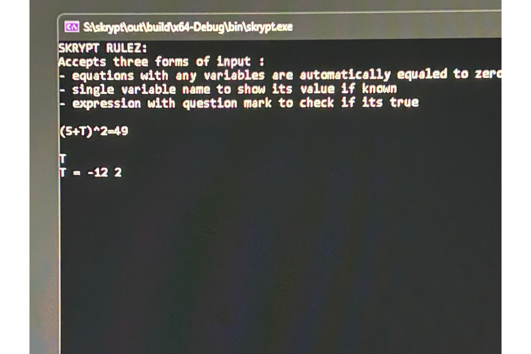

=== Screenshot 2
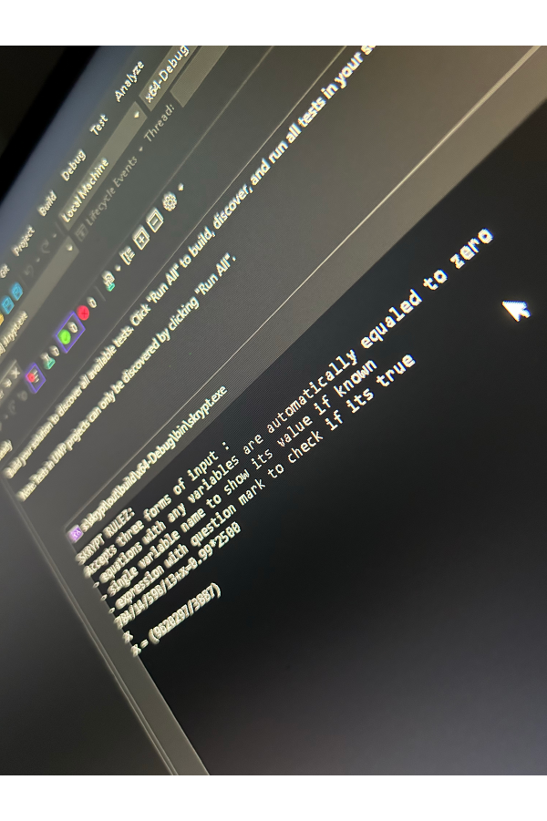

=== Screenshot 3
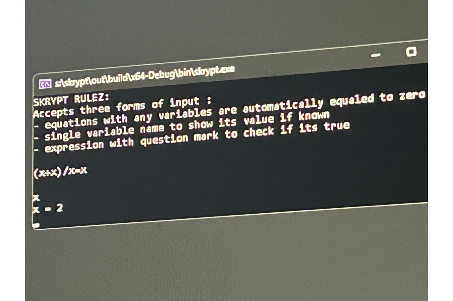

=== Screenshot 4
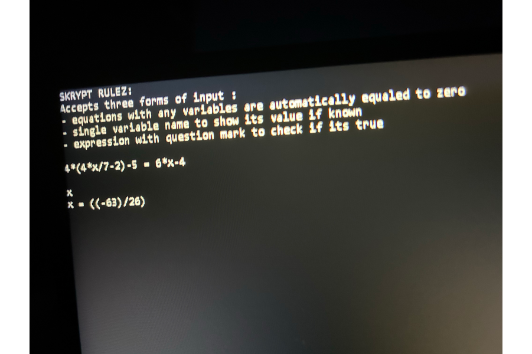

=== Screenshot 5
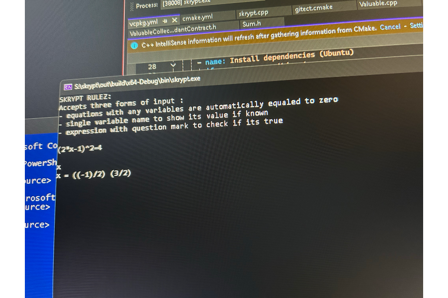

=== Screenshot 6
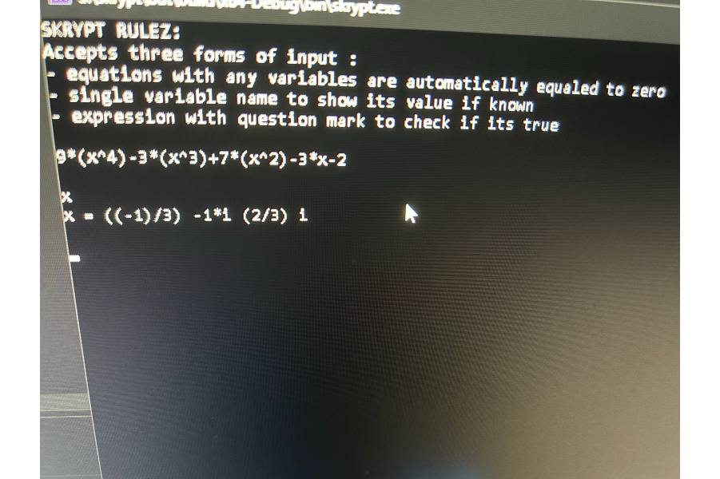

=== Screenshot 7
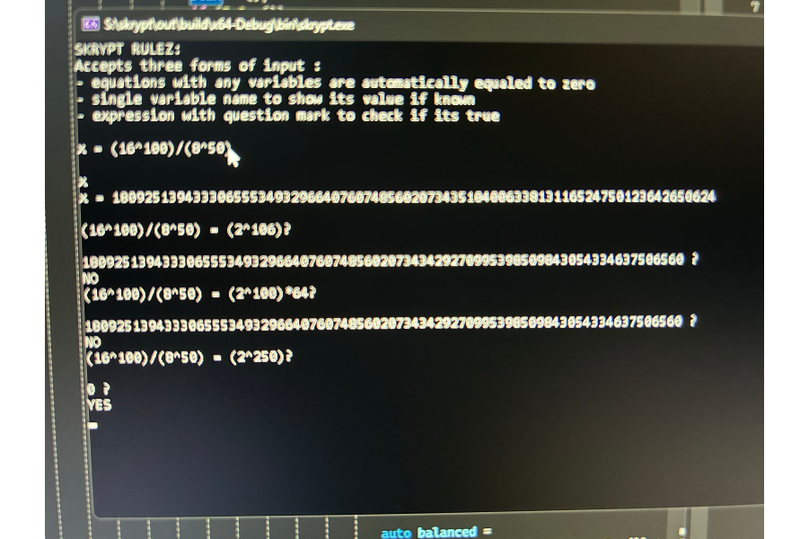

=== Screenshot 8
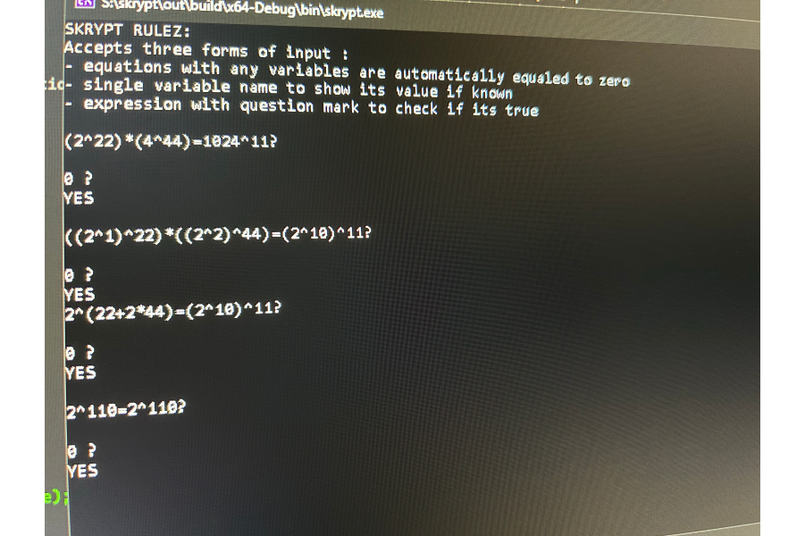

=== Screenshot 9
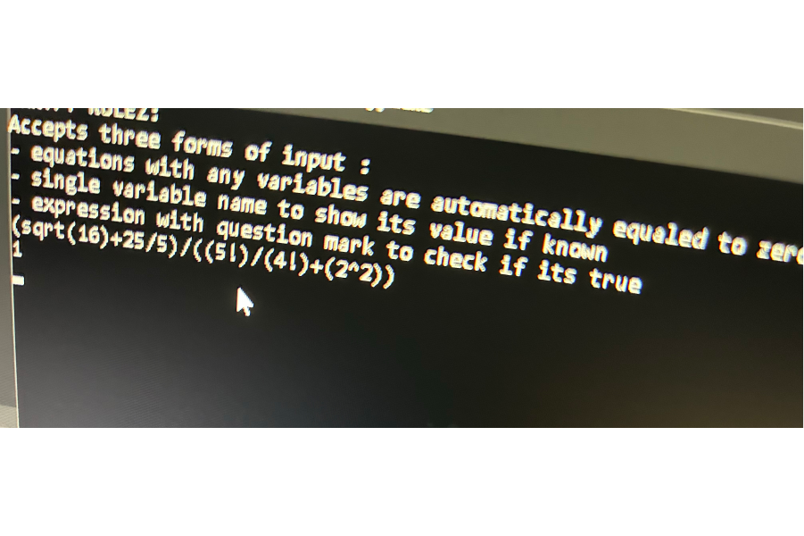

=== Screenshot 10
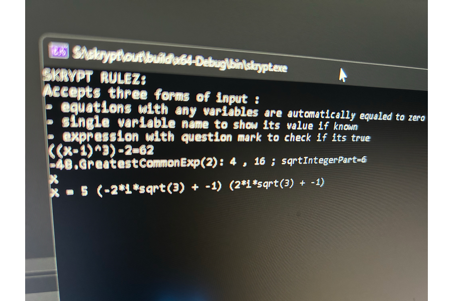

=== Screenshot 11
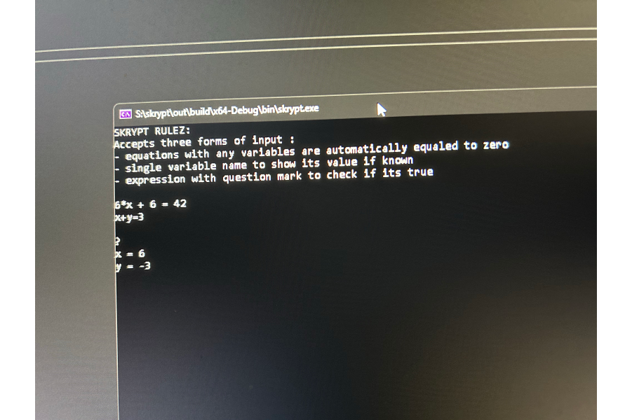

=== Screenshot 12
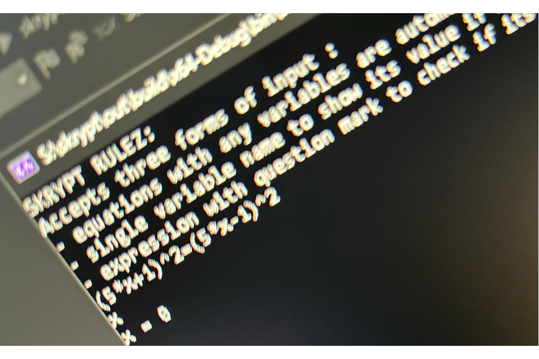

=== Screenshot 13
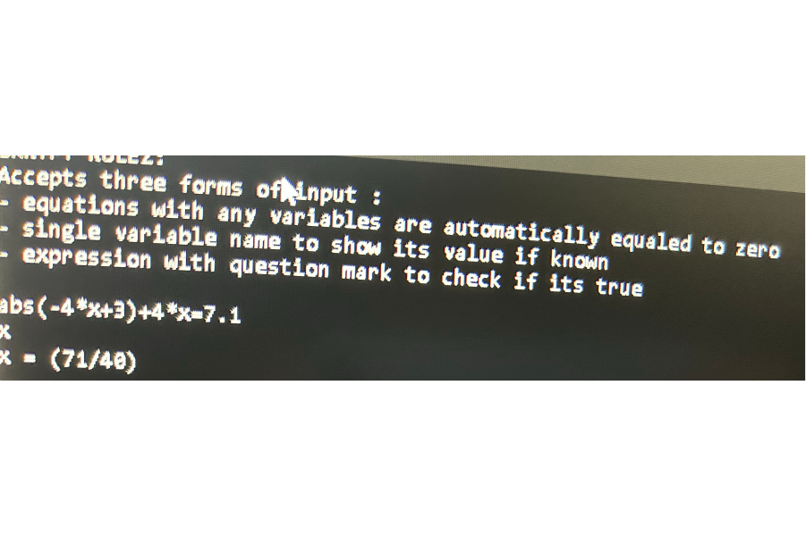

=== Screenshot 14
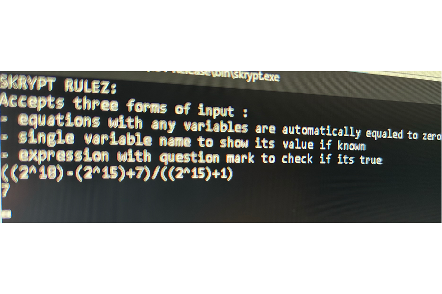

=== Screenshot 15
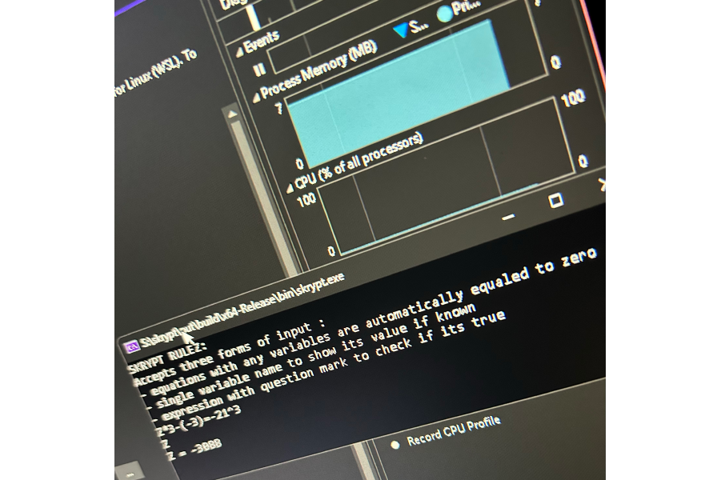
